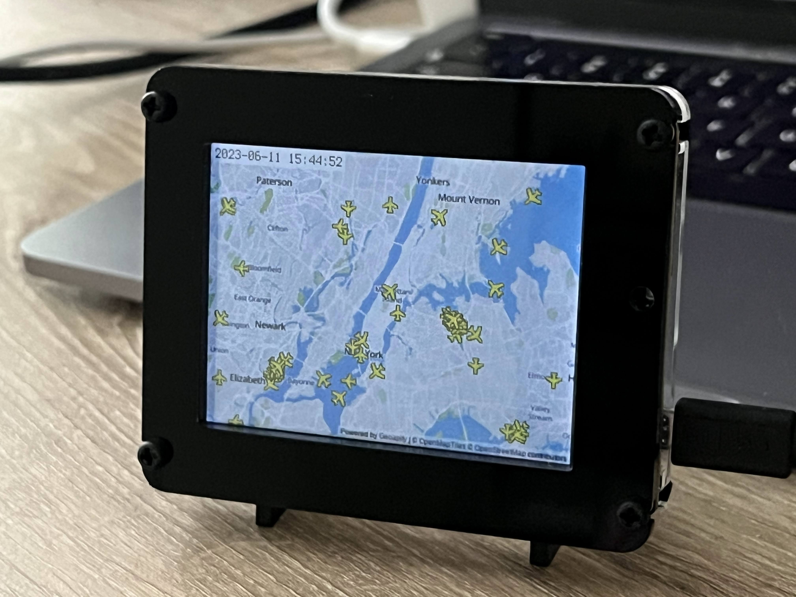

# pyportal-flight-tracker
This repository contains the code, libraries, and image assets required to build the PyPortal Flight Tracker. Read a full build tutorial for this project on [Hackster.io](https://www.hackster.io/rhammell/pyportal-flight-tracker-0be6b0).

## How It Works
The Flight Tracker collects and visualizes real-time flight data on a PyPortal device, enabling users to track and monitor the live positions of aircraft through a dynamically updating map.

To begin, a custom map image is downloaded to the PyPortal, centered on a location coordinate defined by the user. This image serves as the background for the map display. 

Then, at regular intervals of thirty seconds, the Flight Tracker sends a request to the OpenSky Network API, retrieving live aircraft data that falls within the boundaries of the map. 

The received aircraft positions are plotted as icons on the map, allowing users to easily view and track their movements in real-time.

## Completed Project

